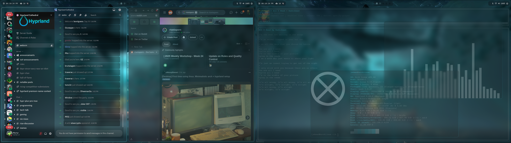
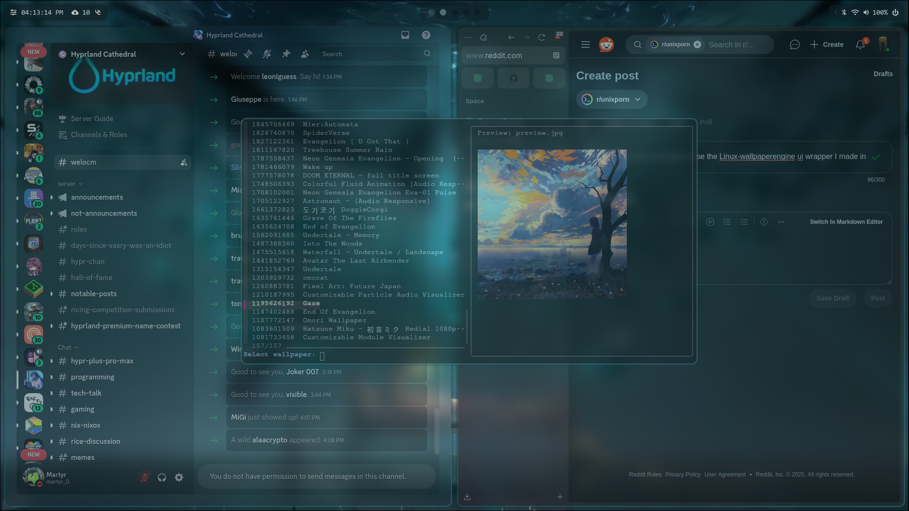
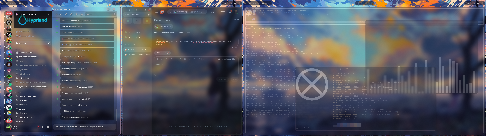
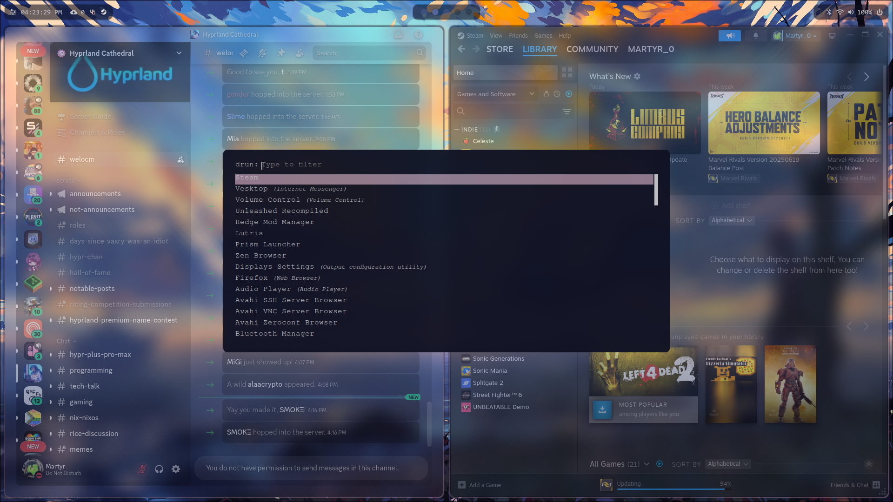

# My Dotfiles

Minimal and clean Arch Linux rice using Hyprland. 

Featuring wallset-engine (TUI for linux-wallpaperengine) 
(to use wallset-engine go to https://github.com/Jmotions/wallset-engine and follow the install instructions)

---

## Usage

```bash
git clone https://github.com/Jmotions/dotfiles.git ~/dotfiles
cd ~/dotfiles
```
---

## Screenshots









